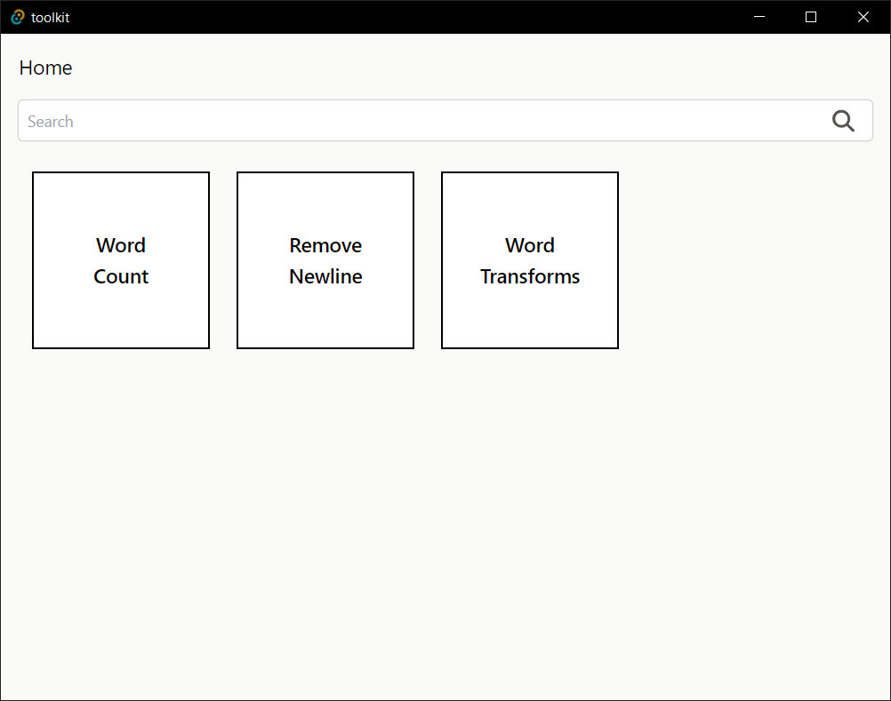

# toolkit
Bundle of useful tools that I always use
 

---

## List of Tools
| Tools | Library |  | 
| --- | --- | --- |
text count | none | :white_check_mark: | 
text transform | none | :white_check_mark: | 
text added | none | :white_check_mark: | 
remove newline | none | :white_check_mark: | 
gear calc | none | :white_check_mark: | 
QR Code Scanner | [qr-scanner](https://github.com/nimiq/qr-scanner) | :white_check_mark: | 
Color Detector | none | :white_check_mark: | 
tailwind color similarity | none | :white_check_mark: | 
excel to sql | [react-excel-renderer](https://github.com/ashishd751/react-excel-renderer) | :white_check_mark: | 
sql formatter | [sql-formatter](https://github.com/sql-formatter-org/sql-formatter) | :white_check_mark: | 

---

## Stack
It is created using those amazing technologies:
- [React](https://nextjs.org/)
- [Tailwind](https://tailwindcss.com/)
- [Tauri](https://tauri.studio/)
- And many others!

---

## License
>You can check out the full license [here](https://github.com/hafizhaziq307/toolkit/blob/main/LICENSE)

This project is licensed under the terms of the **MIT** license.
