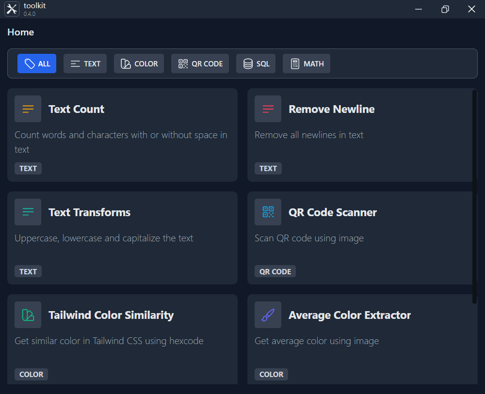

# toolkit
Bundle of useful tools that I always use
 

---

## List of Tools
| Tools | Library |
| --- | --- |
text count | none |
text transform | none |
text added | none |
remove newline | none |
QR Code Scanner | [qr-scanner](https://github.com/nimiq/qr-scanner) |
Color Detector | none |
tailwind color similarity | none |
excel to sql | [excelJs](https://github.com/exceljs/exceljsr) |
sql formatter | [sql-formatter](https://github.com/sql-formatter-org/sql-formatter) |
Image Converter | none | :white_check_mark: |

---

## Stack
It is created using those amazing technologies:
- [Svelte](https://svelte.dev/)
- [Tailwind](https://tailwindcss.com/)
- [Tauri](https://tauri.studio/)
- And many others!

---

## License
>You can check out the full license [here](https://github.com/hafizhaziq307/toolkit/blob/main/LICENSE)

This project is licensed under the terms of the **MIT** license.